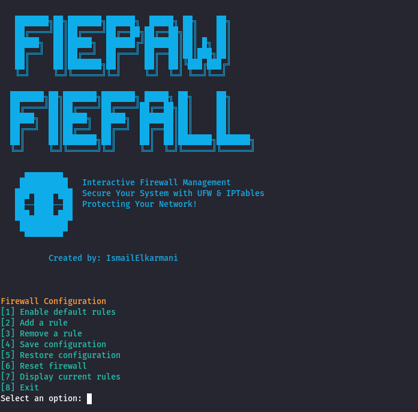

<center>
<h2>
  
  
  </h2>
	
# Interactive-Firewall-Management

Secure Your System with UFW & IPTables

## Overview

Interactive Firewall Management is a Bash-based CLI tool that simplifies the configuration and management of firewall rules using UFW (Uncomplicated Firewall) and IPTables. This script allows users to efficiently add, remove, display, and save firewall rules to enhance system security.  


  
## Features

- Interactive CLI – Manage firewall rules via a user-friendly menu.
- Predefined Rules – Quick options for SSH, HTTP, HTTPS, and IP blocking.
- Backup & Restore – Save and restore firewall configurations easily.
- Logging & Status – Monitor firewall rules with detailed logs.
- Color-coded UI – Clear visual feedback in the terminal.

## Project Structure

| File/Folder                 | Description                                   |
|-----------------------------|-----------------------------------------------|
| `firewall_config.sh`        | Main firewall management script (CLI)        |
| `firewall_config_example.sh`| Example configuration script                 |
| `backup.rules`              | Backup file for firewall rules               |
| `LICENSE`                   | License file (MIT)                           |
| `.gitignore`                | Prevents unnecessary files in Git            |
| `README.md`                 | Project documentation                        |
| `logo.txt`                  | ASCII banner (optional)                      |
## Installation

1- Clone the Repository
```
git clone https://github.com/IsmailElkarmani/Interactive-Firewall-Management.git
cd Interactive-Firewall-Management
```
2- Make the Script Executable
```
chmod +x firewall_config.sh
```
3- Run the Firewall Management Tool
```
./firewall_config.sh
```
## Usage

Once the script is executed, you will see an interactive menu:

[1] Enable default rules  
[2] Add a rule  
[3] Remove a rule  
[4] Save configuration  
[5] Restore configuration  
[6] Reset firewall  
[7] Display current rules  
[8] Exit  

- Example: Add a Rule   

	• Select option `[2]` Add a rule

	• Choose from predefined rules: SSH, HTTP, HTTPS, or block an IP.

	• The rule is instantly applied and saved.

- Example: Save Firewall Configuration

	• Select option `[4]` Save configuration

	• Enter a filename (ex: backup.rules)

	• The current rules are saved for future restoration.

## Security Best Practices

✔ Always deny incoming connections by default unless required.

✔ Keep SSH access restricted to known IPs.

✔ Regularly review logs to detect suspicious activity.

✔ Use the backup feature before making major changes.

## License

This project is licensed under the MIT License – see the [MIT license](LICENSE) file for details.

## Contributing

Contributions are welcome! If you have suggestions, feel free to:
  - Fork the repository
  - Create a new branch
  - Submit a pull request

## Contact
[GitHub](https://github.com/IsmailElkarmani)

## ⭐ If you find this project helpful, don’t forget to give it a star! ⭐
